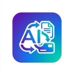
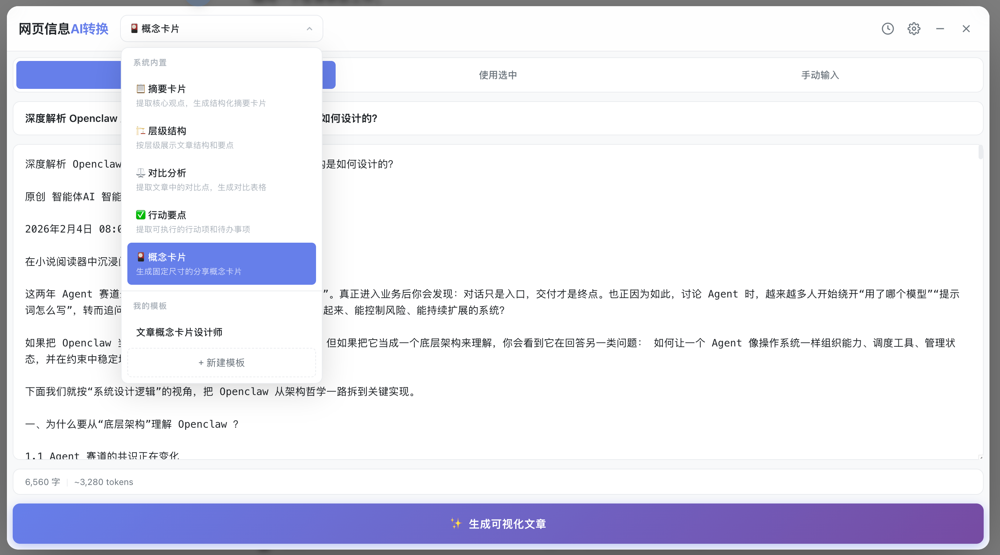
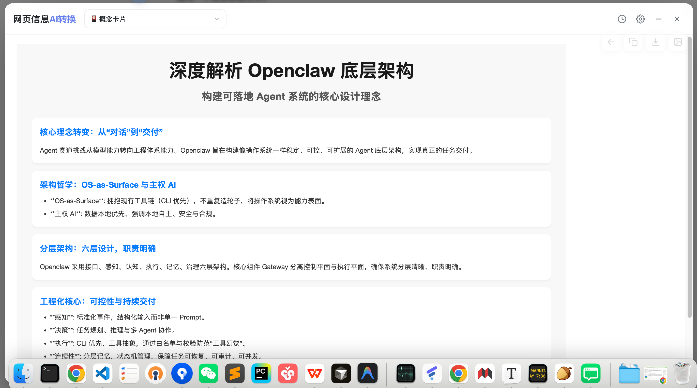
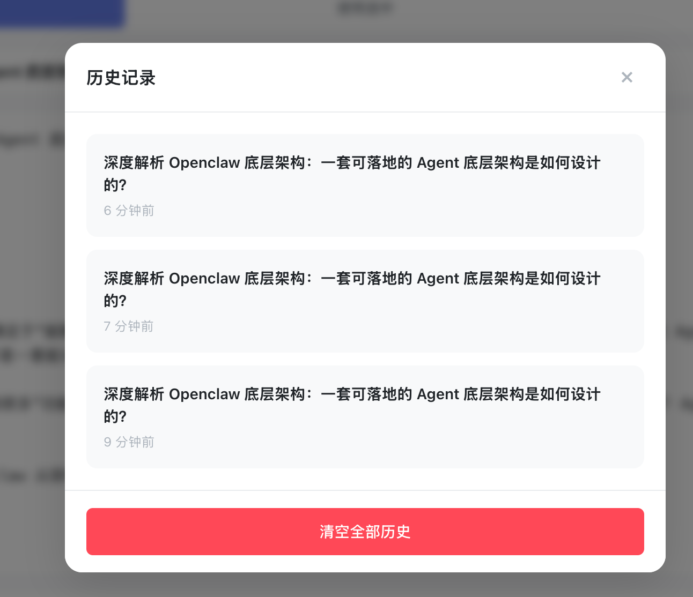

#  网页文章可视化重构器 (Chapter AI Transform)

> 一键将冗长的网页文章转化为极简现代、高可读性的可视化阅读卡片。

## 📖 简介

**网页文章可视化重构器** 是一款基于 Chrome Extension V3 架构开发的浏览器插件。它利用 AI 大模型（如 GPT-4o-mini）的强大能力，智能提取网页核心内容，并将其重构为设计精美、结构清晰的 HTML 可视化卡片。无论是学习资料、技术博客还是新闻资讯，都能瞬间转换为易于阅读和分享的形式。

## ✨ 核心功能

- **🤖 智能抽取与重构**：自动识别网页正文，过滤广告与干扰，通过 AI 进行结构化总结与重构。
- **🎨 现代化可视化设计**：支持多种内置可视化模板（摘要卡片、层级结构、对比分析、行动要点等），美观大方。
- **📝 强大的 Prompt 管理**：内置多款精心调优的 Prompt，同时支持自定义 Prompt，满足个性化需求。
- **🛡️ 安全沙箱渲染**：使用 Shadow DOM + Sandbox Iframe 技术，确保渲染结果安全且不影响原网页样式。
- **💾 历史记录管理**：自动保存生成历史，随时回溯查看。
- **📤 多格式导出**：支持一键复制 HTML、下载 HTML 文件或导出为高清图片。
- **⚙️ 灵活配置**：支持自定义 OpenAI 兼容接口（Endpoint, API Key, Model 等）。

## 🛠️ 安装说明

### 直接安装

1. 下载项目根目录下的 `chapter_ai_transform.crx` 文件。
2. 在 Chrome 浏览器中访问 `chrome://extensions/`。
3. 确保右上角的 **"开发者模式" (Developer mode)** 已开启。
4. 将下载好的 `.crx` 文件直接拖拽到扩展程序页面中。
5. 在弹出的确认框中点击 **"添加扩展程序"**。

### 开发模式安装

1. 克隆或下载本项目到本地。
2. 打开 Chrome 浏览器，访问 `chrome://extensions/`。
3. 开启右上角的 **"开发者模式" (Developer mode)**。
4. 点击 **"加载已解压的扩展程序" (Load unpacked)**。
5. 选择本项目中的 `chapter_ai_transform` 目录。
6. 安装完成！

## 🖼️ 界面预览

### 主界面与模板选择
插件侧边栏主界面，包含文章标题、模板选择（摘要卡片、层级结构、概念卡片等）以及“生成可视化文章”按钮。


### 可视化结果预览
AI 生成后的“概念卡片”预览效果，排版精美且支持导出功能。


### 模型配置
插件的 AI 模型配置界面，支持自定义 API Endpoint、模型名称、API Key 等参数，以及查看调试日志。


### 历史记录
插件的历史记录管理功能，方便回溯之前生成的总结内容。


## 🚀 使用指南

1. **配置 API**：
   - 点击插件图标或右键菜单，进入 **"配置"**。
   - 输入您的 AI 模型 API 信息（Endpoint, API Key, Model 等）。
   - 推荐使用支持流式输出的 OpenAI 兼容接口。

2. **开始使用**：
   - 打开任意文章网页。
   - 点击浏览器右上角的插件图标，或使用右键菜单 **"用 AI 可视化选中内容"**。
   - 悬浮球会自动出现在页面右侧，点击即可展开面板。
   - 选择合适的 **Prompt 模板**，点击 **"生成可视化"**。

3. **结果操作**：
   - 生成完成后，您可以预览渲染结果。
   - 使用右上角的悬浮按钮进行 **复制**、**下载代码** 或 **保存图片**。

## 📂 项目结构

```
chapter_ai_transform/
├── manifest.json            # 插件配置文件 (MV3)
├── icons/                   # 图标资源
├── src/
│   ├── background/          # 后台服务 (Service Worker)
│   ├── content/             # 内容脚本 (抽取与注入)
│   ├── ui/                  # UI 面板 (HTML/CSS/JS)
│   ├── utils/               # 工具函数 (API, Storage, Sanitize 等)
│   └── config/              # 默认配置与 Prompts
└── package.json             # 项目元数据
```

## 💻 技术栈

- **Core**: Vanilla JavaScript (ES Modules)
- **Extension**: Chrome Manifest V3
- **UI**: Native DOM, Shadow DOM, CSS Variables
- **Rendering**: Sandboxed Iframe
- **Utilities**: html2canvas (截图), DOMPurify-like logic (净化)

## 🤝 贡献

欢迎提交 Issue 或 Pull Request 来改进这个项目！

## 📄 许可证

MIT License
